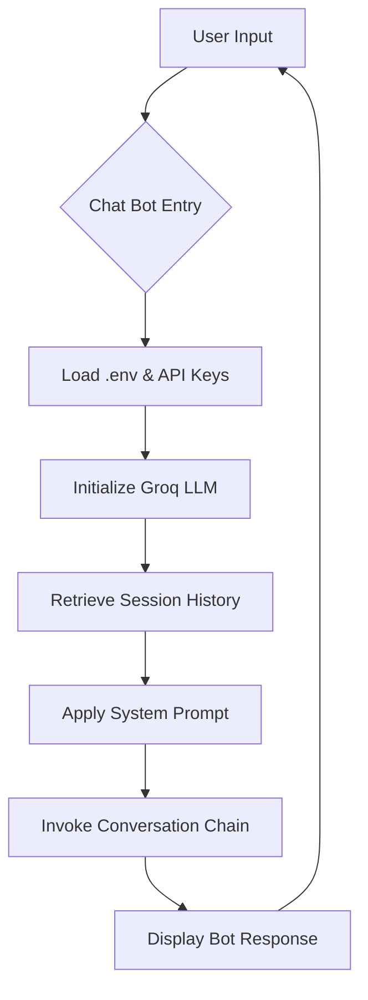

# Financial Advisor AI Chatbot


A high-performance, intelligent financial advisor chatbot built with LangChain, Groq, and Llama 3. This system provides concise, expert-level insights into personal finance, budgeting, and investment strategies while maintaining a persistent conversation memory.

---

## Key Features

- **Expert Financial Insights**: Specialized in personal finance, savings, and investment guidance.
- **Persistent Memory**: Maintains previous interactions within a session for contextual conversations.
- **High-Performance Inference**: Leverages the Llama-3.3-70b-versatile model via Groq for near-instant response times.
- **Concise Logic**: Optimized prompt engineering to provide direct and clear answers without unnecessary verbosity.
- **Robust Error Handling**: Integrated connection testing and retry logic for a seamless user experience.

---

## Technical Specifications

- **Large Language Model**: [Llama 3.3 (70B)](https://groq.com/) via Groq API.
- **Orchestration**: [LangChain](https://www.langchain.com/) for chain management and memory.
- **Environment Management**: python-dotenv for secure API key handling.
- **History Management**: ChatMessageHistory for session-based state.

---

## Project Flow



---

## Setup and Installation

### 1. Clone the Repository
```bash
git clone https://github.com/Azohajutt/Financial-Chatbot.git
cd Financial-Chatbot
```

### 2. Install Dependencies
Ensure Python is installed, then execute:
```bash
pip install -r requirements.txt
```

### 3. Configure Environment Variables
Create a .env file in the root directory and define the Groq API key:
```env
GROQ_API_KEY=your_groq_api_key_here
```
The API key can be obtained from the [Groq Console](https://console.groq.com/).

---

## Operation

To initialize the chatbot, run the following command:
```bash
python chat_bot.py
```

- **Inquiries**: Examples include "How should I start saving for retirement?" or "Explain the 50/30/20 budget."
- **Contextual Memory**: The system retains information shared previously in the session, such as income or financial goals.
- **Termination**: Use the commands 'quit', 'exit', or 'bye' to terminate the session.

---

## Disclaimer
This chatbot provides general financial information only. It is not a substitute for professional, licensed financial advice. Always consult with a certified financial planner for personalized investment or tax strategies.

---

## License
This project is licensed under the MIT License - see the LICENSE file for details.
